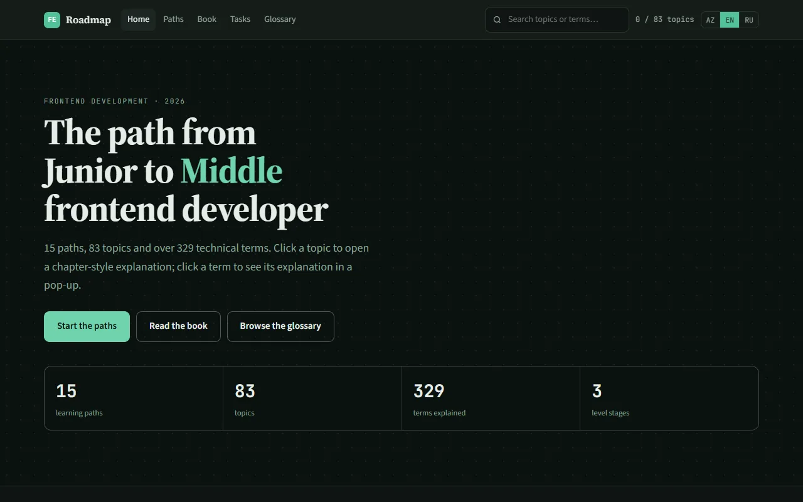
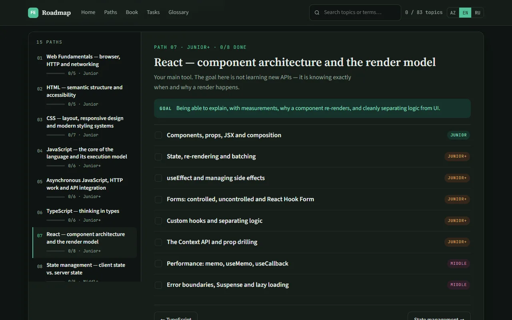
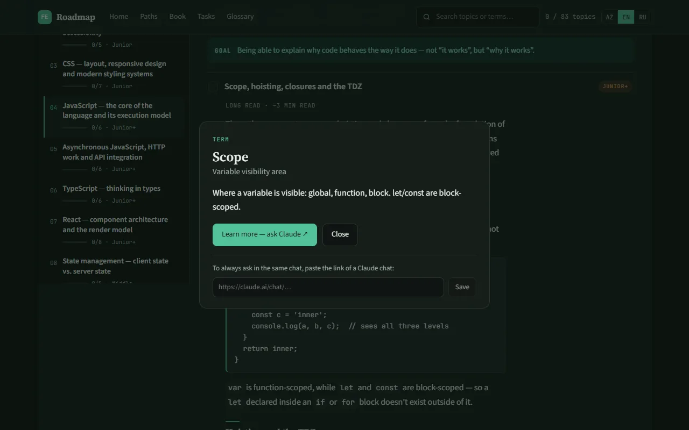
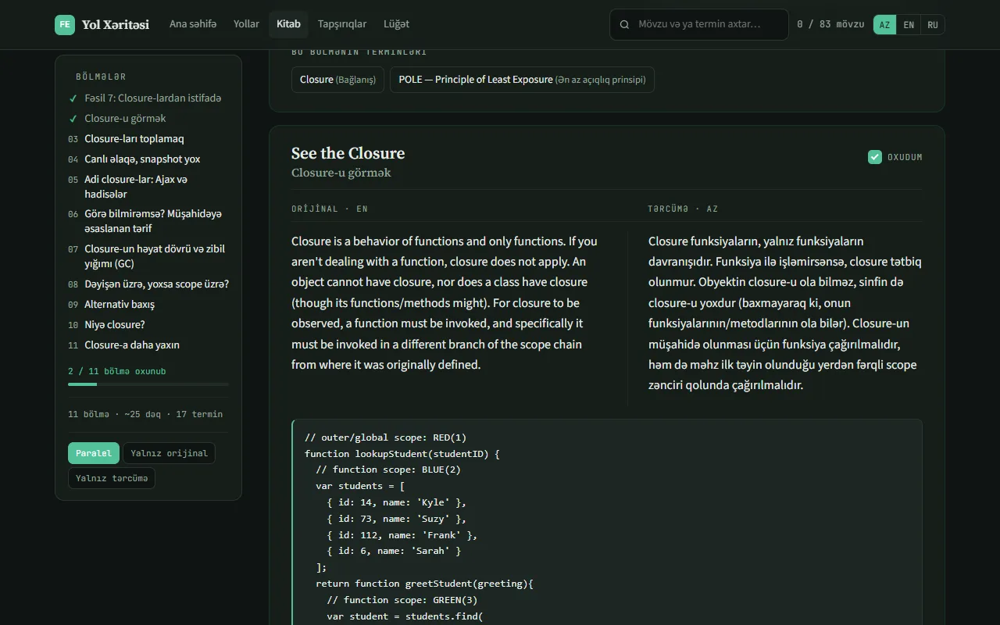
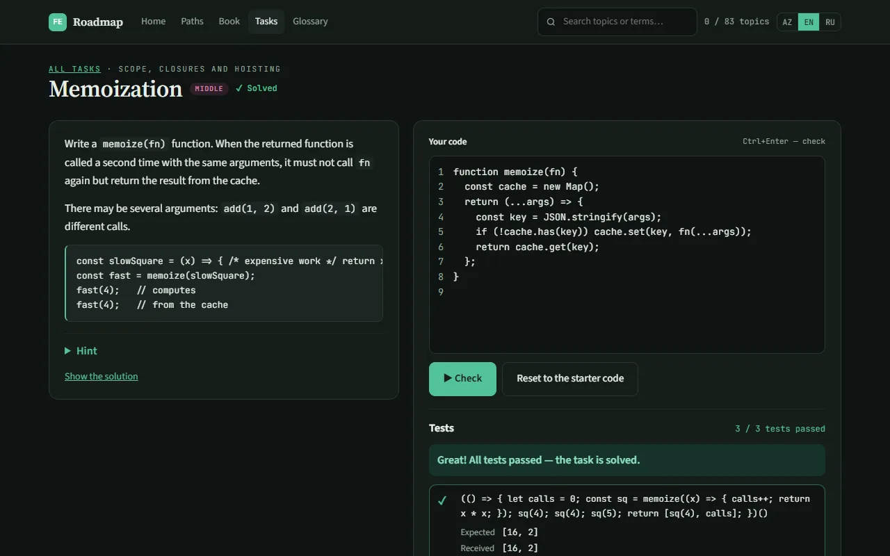
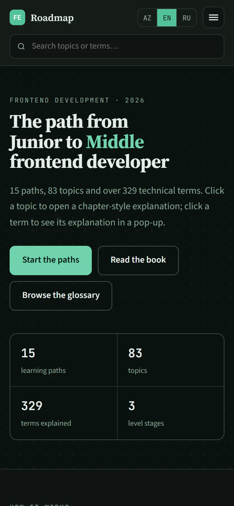
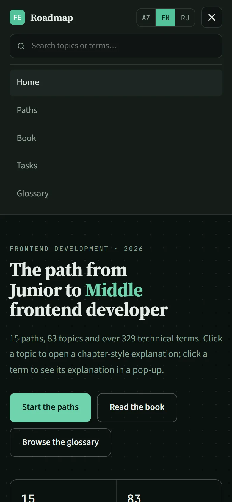
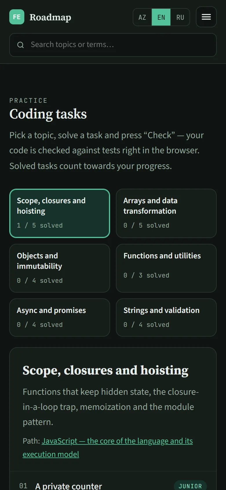

<div align="center">


# FrontendPath

**A learning roadmap from Junior to Middle frontend developer — in Azerbaijani, English and Russian.**

Read chapter-style topics, look up any technical term in one click, study a classic JavaScript book
side by side with its translation, and practise on coding tasks that are checked right in the browser.

[**Live site →**](https://frontend-path-psi.vercel.app)




</div>

---

## Contents

- [What's inside](#whats-inside)
- [Features](#features)
- [Quick start](#quick-start)
- [Tech stack](#tech-stack)
- [Project structure](#project-structure)
- [Routes](#routes)
- [Writing content](#writing-content)
- [How it works](#how-it-works)
- [Deploy your own copy](#deploy-your-own-copy)
- [Troubleshooting](#troubleshooting)
- [Credits and license](#credits-and-license)

## What's inside

| | |
| --- | --- |
| **15** learning paths | from web fundamentals and HTML to React, testing, performance and architecture |
| **83** topics | each written as a chapter: the mechanism, code examples, common mistakes and a mentor note |
| **329** technical terms | every underlined term opens an explanation in a pop-up |
| **8** book chapters | *You Don't Know JS Yet: Scope & Closures*, with a translation and a mentor note after every section |
| **25** coding tasks | in 6 topics, checked against tests in the browser |
| **3** languages | Azerbaijani, English and Russian — every piece of text, including the UI |

## Features

### Learning paths

Paths are grouped into stages (Junior → Junior+ → Middle). Open a path, read a topic, click the terms
you don't know and mark the topic as done. The progress bar in the top bar counts finished topics.



### Terms in one click

Every technical term in the text is a link. Clicking it opens a pop-up with the translation, a short
explanation and, often, a code example. The **Learn more — ask Claude** button sends a ready-made
question about the term to Claude — see [Asking Claude](#asking-claude-from-a-term-pop-up).



### Book reading

All 8 chapters of *You Don't Know JS Yet: Scope & Closures* by Kyle Simpson. The original is shown on
the left and the translation on the right, paragraph by paragraph (or only one of them). Every section
ends with a mentor note that connects the idea to everyday React code and to interview questions.
Sections you mark as read get a ✓ in the sidebar and count towards the chapter's progress.



### Coding tasks

Pick a topic — scope and closures, arrays, objects and immutability, functions, async code, or strings
and validation — and solve a task in the editor. **Check** (or `Ctrl+Enter`) runs your code against the
task's tests and shows the expected and received value for each one, plus anything you
`console.log`. Every task has a hint and a solution you can reveal.



### Three languages

Switch with **AZ / EN / RU** in the top bar. The choice is remembered, and English is the default.
English and Russian content is loaded only when that language is picked, so the default bundle stays
small. In English mode the book is shown in the original only.

### Progress on every device

Topics, book sections and solved tasks are saved in the browser. Turn on sync in the footer and you get
a code like `k7mn-p2qx-a9wd-t4ze`; enter it on your phone or another computer and your progress and
saved Claude chat link follow you there. There's no sign-up.

### Works on any screen

The layout is responsive from 320 px phones to wide desktops, with a mobile menu, a full-width search
row on small screens and a light and a dark theme that follow the system setting.

<table>
  <tr>
    <td></td>
    <td></td>
    <td></td>
  </tr>
</table>

## Quick start

You need **Node.js 20+**.

```bash
git clone https://github.com/Seymur-Mustafayev/FrontendPath.git
cd FrontendPath
npm install
npm run dev        # http://localhost:5173
```

Everything works locally except cross-device sync, which needs the serverless function and a database
(see [Deploy your own copy](#deploy-your-own-copy)).

| Script | What it does |
| --- | --- |
| `npm run dev` | starts the Vite dev server with hot reload |
| `npm run build` | type-checks and builds the production site into `dist/` |
| `npm run preview` | serves the production build locally |
| `npm run typecheck` | runs `tsc --noEmit` |
| `npm run i18n:check` | checks that the English and Russian translations are complete |

## Tech stack

- **React 18** and **React Router 6** — a single-page app; the tasks pages are lazy-loaded
- **TypeScript 5** in strict mode
- **Vite 5** — dev server and build, with separate chunks for vendor code, content and each language
- **Vercel** — static hosting plus one serverless function (`api/sync.js`)
- **Upstash Redis** — storage for synced progress
- No UI or CSS framework: one token-based stylesheet with light and dark themes

Runtime dependencies are just `react`, `react-dom` and `react-router-dom`.

## Project structure

```
api/
  sync.js               Vercel function: stores synced progress in Redis (GET / PUT)
docs/screenshots/       images used in this README
public/
  claude-ask.user.js    Tampermonkey userscript: sends questions to an open Claude tab
  favicon.svg
scripts/
  i18n.mjs              translation completeness check and export of untranslated text
src/
  data/                 all content (the Azerbaijani source), separate from the UI
    paths.ts            15 paths and their topics
    deep.ts             long chapter texts for topics, keyed by "pathId.index"
    glossary.ts         terms: [English, Azerbaijani, explanation, code example?]
    books.ts            the book and chapter 1
    book-scope/         chapters 2–8 of the book, one file per chapter
    terms.book.ts       book terms (chapter 1)
    terms.scope.ts      book terms (chapters 2–8)
    tasks.ts            coding tasks: text in AZ/EN/RU, starter code, solution and tests
  i18n/
    ui.ts               interface text in AZ / EN / RU
    units.ts            translation unit keys and the translation file parser
    content.ts          builds the content for the selected language
    useLocale.tsx       language context: useLocale / useUI / useContent
    locales/en/*.txt    English translations
    locales/ru/*.txt    Russian translations
  lib/
    useProgress.tsx     progress, the saved Claude chat link and sync
    sync.ts             sync codes and /api/sync requests
    runTests.ts         runs task code against its tests in a Web Worker
    search.ts           topic and term search
    content.ts          topic ids, reading time, term references
    useTermDialog.tsx   term pop-up context
  components/           NavBar, TopicBody, TermDialog, CodeEditor, SyncPanel, …
  pages/                Home, Path, Books, Chapter, Tasks, Task, Glossary, Search, NotFound
  styles/global.css     all styles: design tokens, light and dark themes
```

## Routes

| Path | Page |
| --- | --- |
| `/` | Hero, how it works, and path cards grouped by stage |
| `/yol/:pathId` | A path's topics (`?t=3` opens topic 3 and scrolls to it) |
| `/kitab` | The library: the book and its chapters with reading progress |
| `/kitab/:bookId/:chapterId` | A chapter: the original and the translation side by side |
| `/tapsiriqlar` | Coding tasks by topic (`?m=async` selects a topic) |
| `/tapsiriqlar/:taskId` | A task: description, code editor and test results |
| `/luget` | The A–Z glossary with its own search |
| `/axtar?q=…` | Search results across topics and terms |

## Writing content

All content lives in `src/data/` in Azerbaijani; English and Russian are separate translation files
(see [Translating](#translating)).

### Text format

Topic texts, notes, term explanations and task descriptions share one format, rendered by
`TopicBody`:

| Syntax | Result |
| --- | --- |
| `## Heading` | a subheading |
| ` ```js … ``` ` | a code block (blank lines inside are fine) |
| `> text` | a quote or note |
| `- item` / `1. item` | a list (every line of the paragraph must be an item) |
| `**text**` | bold |
| `` `code` `` | inline code |
| `[[term-key]]` | a glossary term that opens the pop-up |

Paragraphs are separated by a blank line.

### Adding content

- **A topic:** add an object to the path's `topics` array in `src/data/paths.ts`. For a long chapter
  text, add it to `src/data/deep.ts` under the `"pathId.index"` key.
- **A term:** add one entry to `src/data/glossary.ts`. Keys must be unique across the glossary and
  the book term files.
- **A book chapter:** create a file in `src/data/book-scope/` and add it to the book's `chapters` in
  `src/data/books.ts`. Each section is a list of blocks: `{ en, az }` renders as a parallel row, and
  `{ code, caption? }` as a full-width code block. The section's `note` is the mentor's explanation.
- **A coding task:** add an object to `TASKS` in `src/data/tasks.ts` with the text in all three
  languages, `starter`, `solution` and `tests`. A test is `{ call, expect }` or
  `{ call, throws: true }`, where `call` is any expression — it may return a Promise. Check that the
  solution passes every test and the starter code doesn't.

### Translating

After adding Azerbaijani content, export what still needs translating:

```bash
node scripts/i18n.mjs export en missing-en.txt
node scripts/i18n.mjs export ru missing-ru.txt
```

Translate the file, keeping every `@@ key` line and every `[[term]]` reference, and put it into
`src/i18n/locales/<lang>/`. Then run:

```bash
npm run i18n:check
```

The check reports missing or extra keys, mismatched `[[term]]` references, a different number of code
blocks and any Azerbaijani letters left in a translation. Until a unit is translated, the site falls
back to the Azerbaijani text. Coding tasks keep all three languages inline in `tasks.ts` instead.

## How it works

### Checking coding tasks

The code is run in a **Web Worker** created from a Blob, so it never touches the page. Each test gets a
fresh copy of your code in strict mode (`new Function`), and `console` calls are captured and shown
under the test. If no result arrives for **2.5 seconds** — an infinite loop or a Promise that never
settles — the worker is terminated and the remaining tests are marked as timed out. Results are
compared by deep equality. When every test passes, the task is saved as solved (`task.<id>`) and
synced like the rest of your progress; the code you type is kept in `localStorage`.

### Progress and sync

Progress is a map of done keys: topic ids, `book.<book>.<chapter>.<section>` and `task.<id>`, stored in
`localStorage` (`fe-path-progress-v1`). When sync is on, the server is the source of truth:

- data is loaded when the page opens and whenever the tab becomes visible again;
- changes are sent 800 ms after the last edit with `PUT /api/sync?code=…`;
- the Redis key is `sync:<code>`, the value is a `{ done, chat }` JSON document of at most 100 KB;
- codes have the form `xxxx-xxxx-xxxx-xxxx`.

There's no password: **anyone who knows a sync code can read and change that progress**, so keep it
private.

### Asking Claude from a term pop-up

The **Learn more — ask Claude** button works in three ways:

- **With nothing installed:** it opens a new Claude chat with the question.
- **In the same chat every time:** paste a Claude chat link (`https://claude.ai/chat/…`) at the bottom
  of the pop-up and save it. You can **change** or **remove** it later. The question is copied to the
  clipboard and the chat opens — press `Ctrl+V`, then `Enter`.
- **Fully automatic, with the userscript:** the question is typed into your open Claude tab and sent,
  without opening a new tab.

<details>
<summary><b>Installing the userscript</b></summary>

1. Install the [Tampermonkey](https://www.tampermonkey.net/) browser extension.
2. Allow userscripts:
   - **Chrome:** `chrome://extensions` → Tampermonkey → **Details** → turn on **Allow User Scripts**
     (if it isn't there, turn on **Developer mode** in the top-right corner).
   - **Edge:** `edge://extensions` → turn on **Developer mode** in the bottom-left corner.
3. Tampermonkey icon → **Create a new script** → delete the template → paste the contents of
   [`public/claude-ask.user.js`](public/claude-ask.user.js) → `Ctrl+S`.
4. If you deploy the site on your own domain, add a line for it to the script header:
   `// @match https://your-domain/*`
5. Reload the open claude.ai and site tabs (`F5`).

The script depends on claude.ai's page structure; if the Claude interface changes, the selectors for
the input field and the Send button need updating. Errors are logged to the browser console with the
`[claude-ask]` prefix.

</details>

### Performance and accessibility

- The build is split into chunks — vendor code, the app, content, one per translation language and the
  tasks pages — so a language or the tasks are downloaded only when they're used.
- The term pop-up is a native `<dialog>`, so focus trapping, `Escape` and the backdrop come from the
  browser. The mobile menu closes with `Escape` and on navigation.
- Fonts are chosen to cover the Azerbaijani alphabet and Cyrillic, and the theme follows
  `prefers-color-scheme`. Animations respect `prefers-reduced-motion`.
- Every `localStorage` read and write is wrapped in `try/catch`, so the site works in private mode.

## Deploy your own copy

1. **Fork** this repository.
2. Go to [vercel.com/new](https://vercel.com/new), sign in with GitHub, **Import** the repository and
   click **Deploy**. Nothing needs configuring: Vite is detected, `api/` becomes a serverless
   function, and [`vercel.json`](vercel.json) sends SPA routes to `index.html`.
3. For sync, add a database: **Storage → Create Database → Upstash for Redis** → free plan →
   **Connect to project**. This sets `KV_REST_API_URL` and `KV_REST_API_TOKEN`.
4. **Deployments → latest → ⋯ → Redeploy**, because environment variables only apply to new
   deployments.
5. Open your site, click **Turn on sync** in the footer and check that it says **Synced ✓**.

From then on, every push to `main` deploys automatically. If you use Redis from another provider, set
`UPSTASH_REDIS_REST_URL` and `UPSTASH_REDIS_REST_TOKEN` instead.

**Other hosting:** `npm run build` produces a static site in `dist/` that works anywhere, but sync
won't (it needs the Vercel function). Add an SPA fallback so that unknown paths serve `index.html` —
for example `try_files $uri /index.html;` in Nginx, or
`"navigationFallback": { "rewrite": "/index.html" }` in Azure Static Web Apps.

## Troubleshooting

| Problem | What to check |
| --- | --- |
| Sync says “Could not reach the server” | The database is connected to the project and the site was redeployed after that (steps 3–4 above). |
| Opening `/yol/react` directly gives a 404 | Your host is missing the SPA fallback to `index.html`. |
| The userscript doesn't send anything | Tampermonkey has userscripts allowed, the script's `@match` includes your domain, and both tabs were reloaded. |
| A task says “Timed out” | Your code has an infinite loop, or a Promise that never resolves. |
| `npm run i18n:check` fails | Translate the reported keys, or remove translations for keys that no longer exist. |

## Credits and license

- The book text is *You Don't Know JS Yet: Scope & Closures* by **Kyle Simpson**. It's included for
  personal study; the original text belongs to its author.
- Translations, mentor notes, topics, the glossary and the coding tasks were written for this project.
- The code has no open-source license yet, so all rights are reserved by default.

Made by [Seymur Mustafayev](https://github.com/Seymur-Mustafayev).
